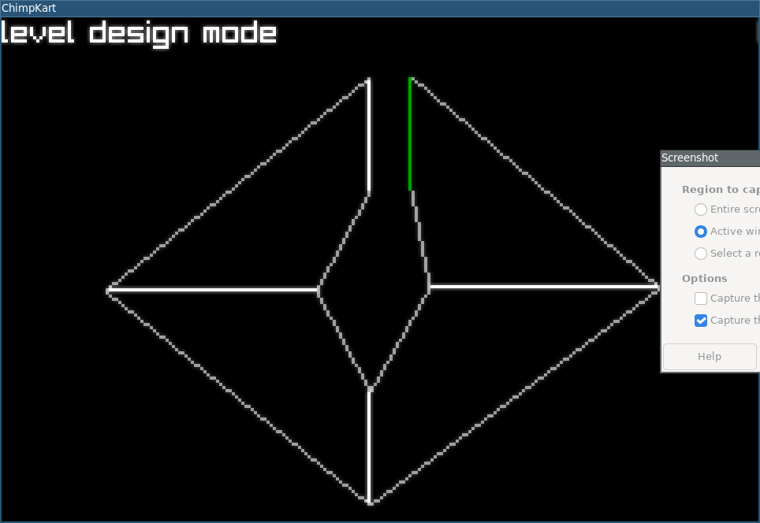

# ChimpKart
mpv race game multiplayor

## Archive Note
Originally built across March 7-8, 2024. This was a rough top-down multiplayer kart/race experiment with tiny cars, walls, sparks, tread marks, smoke, monkey/car audio ideas, and a few track plans in mind.

A recovery pass happened on March 10, 2026 to bump key libraries, fix the broken current `raylib` integration, restore window centering, and get the project compiling again. This was kept intentionally minimal: the repo still has a lot of old template-era structure and warnings, but it builds and runs again for archival purposes.

This repo is abandoned. It is being kept around as an archived experiment, not as an active project.

## Screenshot

## Notes

- [plan.md](plan.md)
